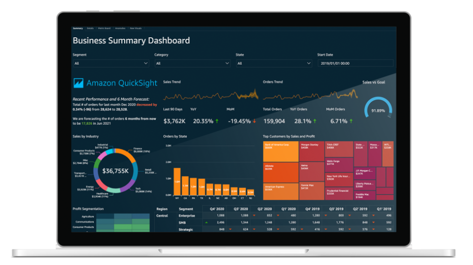
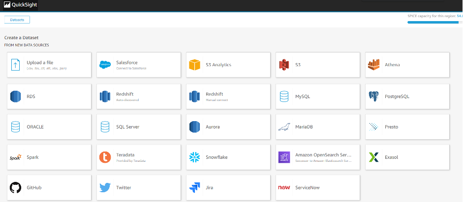

# aws-quicksight-hist-examples

해당 자료는 HIST(한진정보통신)에서 사내 Tech Session을 위해 만든 자료입니다. 

## Table of Contents
1. [About This Repository](#About)
2. [What is AWS QuickSight](#Whatis)
3. [QuickSight Labs](#Labs)

## About This Repository 
해당 레포지토리는 HIST(한진정보통신) 사내 교육 자료로 사용되며, AWS Self BI Service인 AWS QuickSight에 대해서 Quicksight가 무엇이며, 특징, 구성요소 그리고 Hands On Lab을 포함합니다. 

## What is AWS Quicksight 
### AWS QuickSight
- AWS에서 제공하는 서버리스 BI(Business Intelligence) 서비스이다.
- 다양한 DataSet을 구성하여 구성원 모두에게 데이터 중심 결정을 내릴 수 있도록 다양한 Self Designed Dashboard를 지원한다.

### AWS QuickSight 의 특징
1.	다양한 데이터 소스로 부터 데이터셋을 생성 할 수 있다.

    
    - Local File 부터 AWS 내 서비스 뿐 만 아니라, 외부 On-Promise에 시스템 내 정보까지 다양한 부분에서 데이터 소스를 가지고 올 수 있다.
    - 매번 데이터셋에 대한 데이터 조회 없이 일종의 중간 캐시에 해당하는 `SPICE` 저장소에 조회 결과를 저장하여 조회 속도를 향상시킬 수 있다
        - `SPICE` : Super-fast, Parallel, In-memory Calculation Engine    
                    QuickSight 에 데이터를 로드할때 속도를 개선하기 위해 만들어진 인메모리 엔진

2.	사용자 지정 가능한 대시보드 구축
- 사용자에게 스케줄링을 통해 메일로 현재 대시보드를 전송 가능.
- 각 사용자는 AWS 계정을 꼭 가지고 있지 않더라도 사용이 가능. 
- 웹 뿐만 아니라 모바일 기기에서도 접근이 가능.

3.	관리할 서버가 없으며, 사용량에 따라 지불(`서버리스`)
- 서버리스 아키텍처를 수십 만의 사용자에 맞게 자동으로 크기 조정하여 고가용성을 제공하므로 피크 사용량을 위해 오버프로비저닝할 필요가 없음.
- 작성자 1명 24 USD/월, 독자 1명당 최대 5 USD/월, [요금 체계](https://aws.amazon.com/ko/quicksight/pricing/)

4.	비교적 낮은 Learning Curve
- 개발 직군 뿐 아니라 일반 직군의 사용자들도 쉽게 사용할 수 있음.
- 기초 교육만 수행한다면 기본 Dashboard 개발 후 Operation은 현업부서에서 가능 한것으로 판단 됨.

### AWS QuickSight 구성요소
1. **`DataSet`**
    - 다양한 DataSource에서 분석을 위해 Import 시킨 데이터 집합.
    - 하나의 Analysis에는 다양한 DataSets을 포함 할 수 있음.
2. **`Analysis`**
    - BI의 결과물을 저장하는 공간, 만들어진 Analysis를 통해 Dashboard를 Publish할 수 있는 공간.
    - 하나의 Analysis는 여러 개의 Sheet를 가질 수 있음.
3. **`Visual`**
    - Analysis Sheet 위에 위치할 수 있는 Chart, Pivot Table와 같은 객체.
    - 하나의 Sheet에는 여러개의 Visual 객체를 포함할 수 있음.
4. **`Insight`**
    - Quicksight에서 제공하는 현재 사용하는 DataSet을 이용한 다양한 기본 분석.
    - 사용자가 지정하여 다양한 부분에서의 데이터 분석 정보를 표출.
    - 통계 뿐만 아니라 ML(Machine Learning) 기능을 제공.
5. **`Parameter`**
    - Analysis에서 사용하는 DataSet에서 Filtering 기능을 적용하기 위한 파라미터.
6. **`Action`**
    - 사용자 지정 작업이라고 하며, Visual 의 내용을 선택 했을 경우 다음에 일어날 Event를 지정.
    - 기본은 Level이 있을 경우, Level Down 으로 진행 됨.

## QuickSight Labs 

[AWS Quicksight Hands-on Lab](./documents/quicksight-labs-hist.md)
